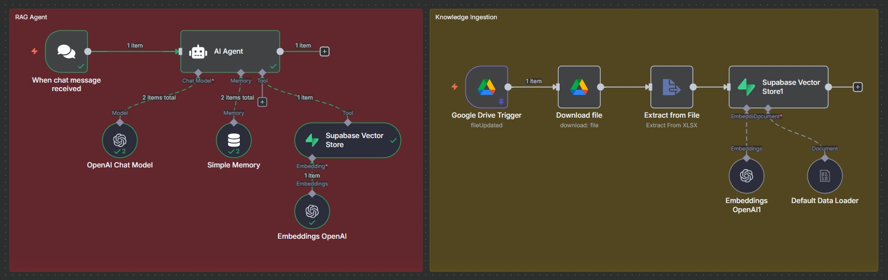

# RAG Agent com Supabase e n8n

Pipeline completo que implementa um agente RAG (Retrieval-Augmented Generation) no n8n, com integração ao Supabase PGVector para armazenamento vetorial e ingestão automática de novos documentos do Google Drive.

---

## Estrutura do Projeto

Este projeto contém um único workflow JSON (Knowledge Ingestion Pipeline.json) que reúne dois fluxos principais:

### RAG Agent
Fluxo responsável por responder perguntas dos usuários utilizando contexto armazenado no Supabase.

Principais nós:
- AI Agent (OpenAI)
- Supabase Vector Store
- Simple Memory
- Embeddings OpenAI

### Knowledge Ingestion
Fluxo responsável por atualizar automaticamente o banco vetorial quando novos arquivos são adicionados no Google Drive.

Principais nós:
- Google Drive Trigger  
- Extract from File (XLSX)  
- Supabase Vector Store  
- Embeddings OpenAI  

---

## Tecnologias Utilizadas
- n8n.io  
- OpenAI GPT & Embeddings  
- Supabase PGVector  
- Google Drive API

---

## Visual do Fluxo

